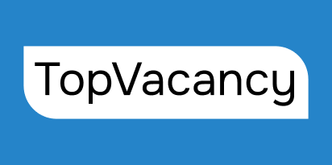
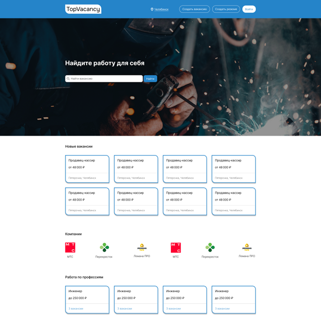
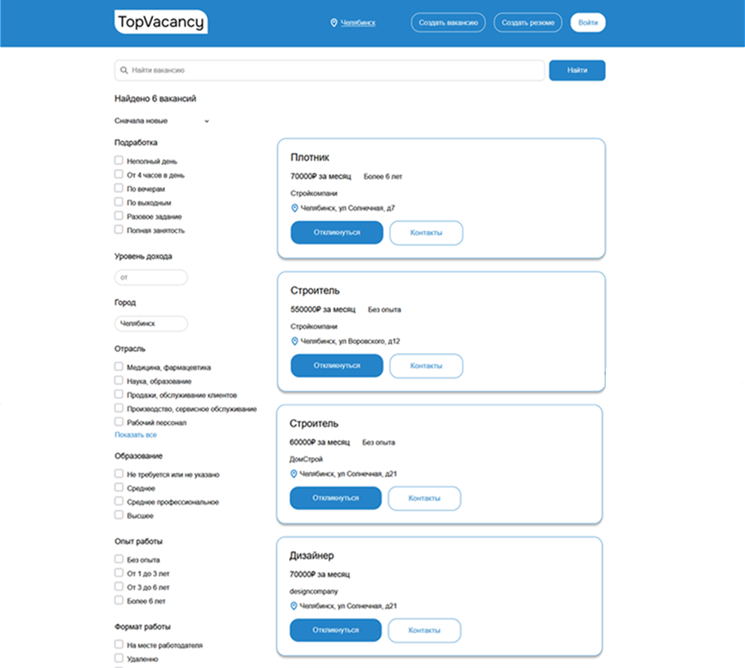
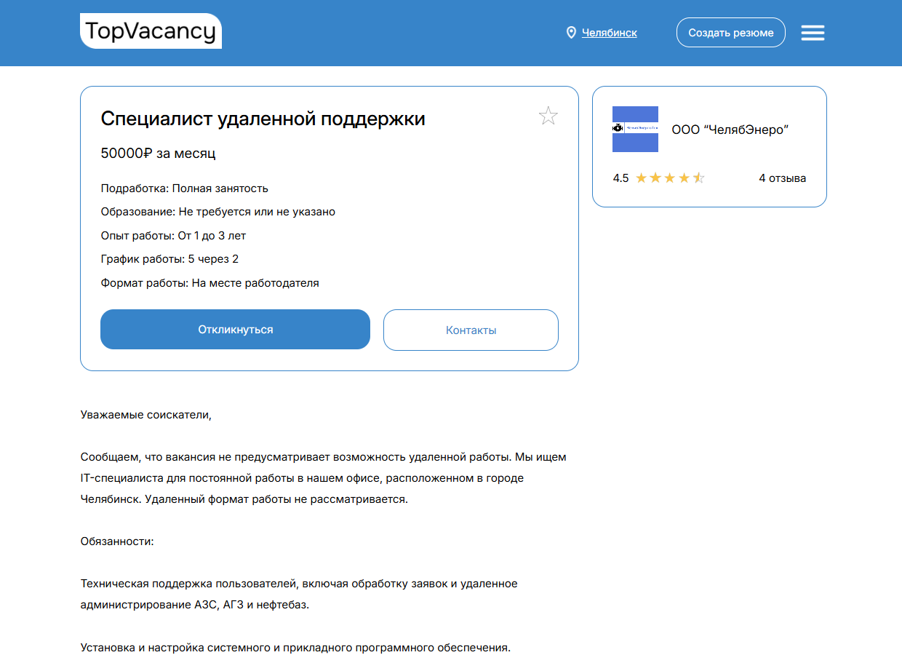
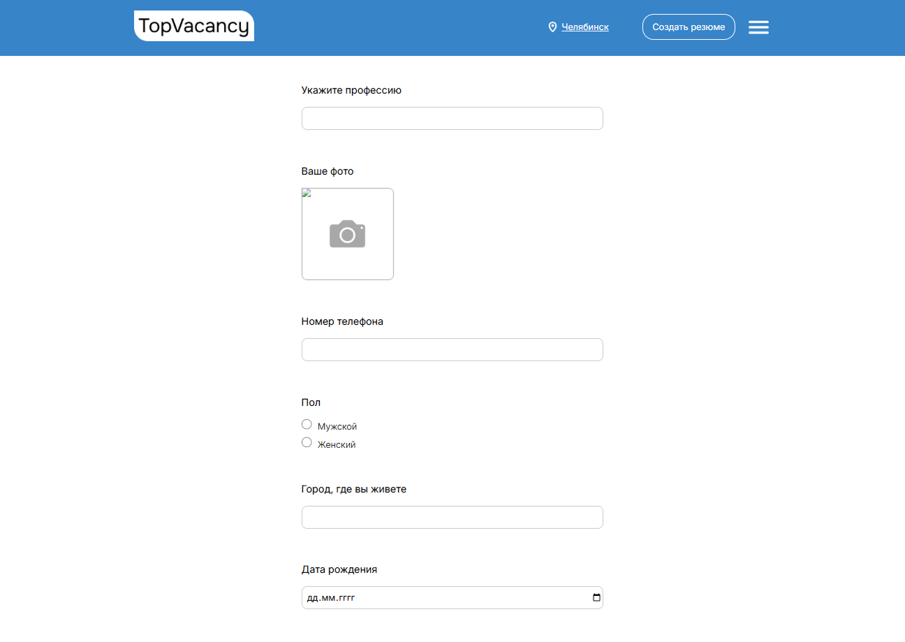

<p align="center">
  
</p>

**TopVacancy** — онлайн-сервис для поиска работы и размещения вакансий.

Платформа позволяет соискателям находить подходящие вакансии, создавать резюме и откликаться на предложения работодателей. Работодатели могут создавать и редактировать вакансии, просматривать отклики и управлять опубликованными предложениями.

## Возможности

### Для соискателей

* Регистрация и авторизация
* Создание и редактирование резюме
* Просмотр вакансий
* Поиск вакансий
* Фильтрация вакансий
* Добавление вакансий в избранное
* Удаление вакансий из избранного
* Отклик на вакансии

### Для работодателей

* Регистрация и авторизация
* Создание компании
* Редактирование информации о компании
* Создание вакансий
* Редактирование вакансий
* Удаление вакансий
* Просмотр откликов соискателей

### Для администратора

* Управление пользователями
* Управление вакансиями
* Управление компаниями
* Управление откликами
* Управление отзывами и другими данными сайта

## Скриншоты

### Главная страница

<p align="center">
  
</p>

### Список вакансий

<p align="center">
  
</p>

### Страница вакансии

<p align="center">
  
</p>

### Создание резюме

<p align="center">
  
</p>

## Технологии

* **PHP**
* **Laravel 12**
* **MySQL**
* **HTML5**
* **CSS3**
* **JavaScript**
* **Blade**
* **Git / GitHub**
* **Figma** — проектирование интерфейса

## Роли пользователей

В системе предусмотрено несколько ролей:

| Роль          | Возможности                                |
| ------------- | ------------------------------------------ |
| Соискатель    | Поиск вакансий, резюме, избранное, отклики |
| Работодатель  | Компания, создание и управление вакансиями |
| Администратор | Управление основными данными системы       |

## Основные сущности

В проекте используются следующие основные модели:

* `User` — пользователь системы
* `Vacancy` — вакансия
* `Company` — компания
* `Category` — категория вакансии
* `Resume` — резюме соискателя
* `Application` — отклик на вакансию
* `Favorite` — избранные вакансии
* `Review` — отзыв

## REST API

Проект также содержит REST API.

Пример получения списка вакансий:

```http
GET /api/vacancies
```

Получение конкретной вакансии:

```http
GET /api/vacancies/{id}
```

API работает в формате JSON.

## Установка

### 1. Клонирование репозитория

```bash
git clone https://github.com/nikitaemelyanov0/TopVacancy.git
cd TopVacancy
```

### 2. Установка зависимостей

Установите PHP-зависимости:

```bash
composer install
```

### 3. Настройка `.env`

Создайте файл `.env` на основе `.env.example`:

```bash
cp .env.example .env
```

Для Windows можно просто скопировать `.env.example` и переименовать копию в:

```text
.env
```

Настройте подключение к базе данных в `.env`:

```env
DB_CONNECTION=mysql
DB_HOST=127.0.0.1
DB_PORT=3306
DB_DATABASE=topvacancy
DB_USERNAME=root
DB_PASSWORD=
```

### 4. Генерация ключа приложения

```bash
php artisan key:generate
```

### 5. Выполнение миграций

```bash
php artisan migrate
```

### 6. Запуск проекта

```bash
php artisan serve
```

После запуска сайт будет доступен по адресу:

```text
http://127.0.0.1:8000
```

## Структура проекта

Основная структура Laravel-проекта:

```text
TopVacancy/
├── app/
│   ├── Http/
│   │   ├── Controllers/
│   │   └── Middleware/
│   └── Models/
├── database/
│   ├── migrations/
│   └── seeders/
├── public/
│   └── assets/
├── resources/
│   └── views/
├── routes/
│   ├── web.php
│   └── api.php
├── storage/
├── .env.example
├── artisan
├── composer.json
└── README.md
```

## Безопасность

Доступ к различным функциям системы ограничивается с помощью middleware и проверки ролей пользователей.

Например, определённые страницы доступны только:

* соискателям;
* работодателям;
* администраторам.

Также выполняется проверка владельца ресурса, например компании или вакансии, перед разрешением на редактирование.

## Интерфейс

Интерфейс проекта разработан с использованием Figma и адаптирован под различные размеры экранов.

Основное внимание уделено:

* удобству поиска вакансий;
* понятной навигации;
* отображению информации о вакансиях;
* удобству создания резюме;
* адаптивности интерфейса.

## Разработка

Проект разрабатывается в рамках учебного проекта по теме:

> **«Проектирование и разработка онлайн-сервиса для поиска работы и размещения вакансий»**

## Автор

**Никита Емельянов**

TopVacancy — онлайн-сервис для взаимодействия соискателей и работодателей.